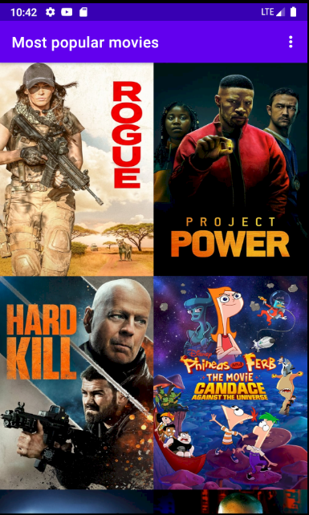
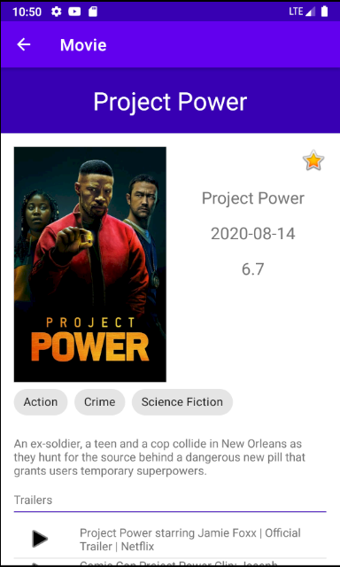

# udacity_movie_stage2

Third project for the Android developer Nanodegree

In the file **services/TheMovieDbServiceWrapper.java** put your api key from https://www.themoviedb.org/ in the **API_KEY** constant

## Screenshots

 

   
